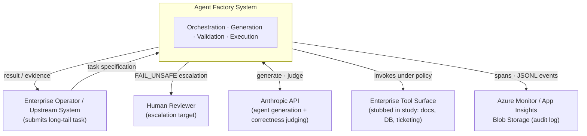
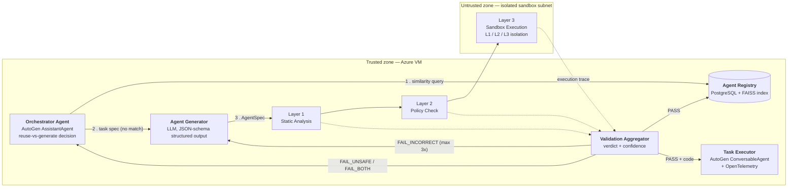
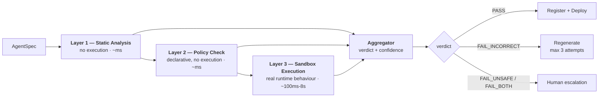
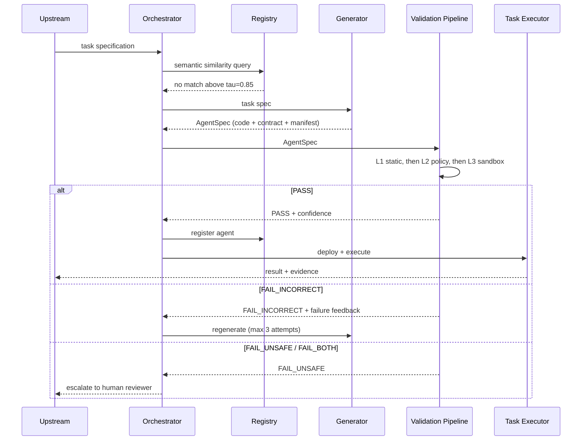
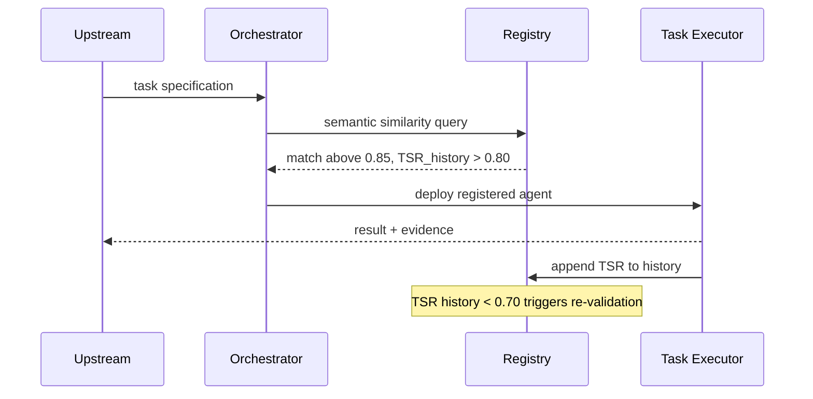
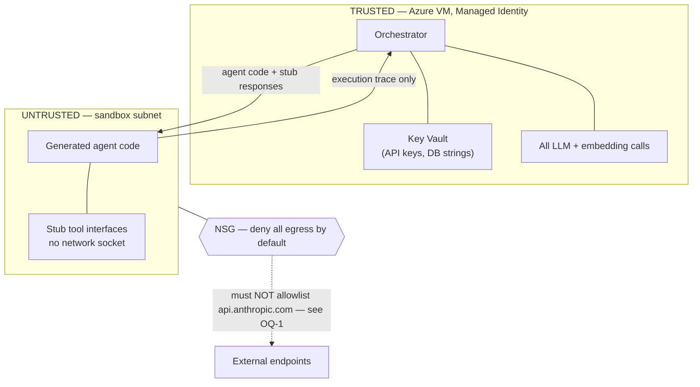
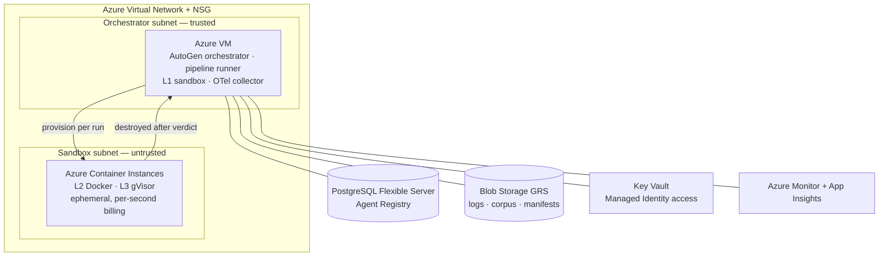

# Agent Factory — Solution Architecture

**System:** Sandbox-First Agent Factory with an Automated Validation Pipeline for LLM-Generated Micro-Agents
**Author:** Bobur Yusupov — IT Park University (`bobur_yusupov@itpu.uz`)
**Specialization:** Solution Architecture and Data Engineering
**Document status:** **Draft for review** — not yet implemented; no measured results are reported here
**Derived from:** `docs/TASK 1`–`docs/Task7` (research programme Tasks 1–7)

---

## 1. Purpose and Scope of This Document

This document specifies the **software architecture** of the Agent Factory system described across Tasks 1–7 of the research programme. It exists to be reviewed on architectural grounds — component boundaries, interfaces, trust model, data flow, and deployment — independently of the research methodology that surrounds it.

**In scope:** system decomposition, the Agent Contract interface, the three-layer validation pipeline, the sandbox isolation spectrum, trust boundaries, data and observability architecture, Azure deployment topology, and the architectural decisions behind each.

**Out of scope:** statistical analysis plans, interview protocols, ethics procedures, and publication strategy. These live in the source task documents and are referenced only where they constrain the architecture.

**Reading note on numbers.** Every quantitative figure in this document is a **design target or budget**, not a measurement. Nothing in this architecture has been built or benchmarked yet. Section 16 flags where the source documents blur this distinction.

---

## 2. Context and Problem

### 2.1 The long-tail automation problem

Enterprise operations generate a continuous stream of tasks that are simultaneously **too specific for a pre-written runbook** and **too urgent to justify a dedicated engineering effort**: a configuration drift affecting one unusual service combination, a one-off legacy report migration, an ad-hoc compliance check triggered by a regulatory inquiry.

Multi-agent LLM frameworks (AutoGen, LangGraph, CrewAI) can decompose and execute such tasks — but their agent repertoire is **static**. When a task falls outside every registered agent's capability, the system degrades gracefully to human escalation. That ceiling is the bottleneck this architecture targets.

### 2.2 The Agent Factory response — and the gap it opens

An **Agent Factory** removes the ceiling: when no registered agent fits, the orchestrator generates a new, narrowly scoped **micro-agent** for that task. This converts a capability problem into a **governance problem**:

> How can an enterprise system automatically determine whether a newly generated agent is **safe to deploy** and **correct enough to be useful** — before it executes against production systems?

The architecture must defend against two independent failure modes:

| Failure mode | Definition | Consequence |
|---|---|---|
| **F1 — Unsafe agent** | Generated code violates enterprise security policy: out-of-scope file reads, unauthorized network egress, state-modifying system commands, credentials in log output | Security incident; blast radius bounded only by the agent's privileges |
| **F2 — Functionally incorrect agent** | Generated code is safe but wrong: misread specification, wrong tool arguments, hallucinated output, unhandled edge cases, partial completion | Silent data corruption; *apparent* task completion masking a wrong result |

F2 is the more insidious of the two: an unsafe agent usually announces itself, whereas an incorrect agent returns a plausible answer.

### 2.3 Architectural position

The Validation Pipeline sits **exactly on the boundary between LLM-generated (untrusted) code and production execution (trusted)**. It is the architectural equivalent of a perimeter firewall: its effectiveness determines whether the rest of the system can be trusted, regardless of how well the other components are built. This is why the design allocates its isolation budget, its observability, and the majority of its complexity to this one component.

---

## 3. Architectural Drivers

### 3.1 Functional requirements

| ID | Requirement |
|---|---|
| FR-1 | Accept a task specification and determine whether a registered agent can serve it |
| FR-2 | Generate a new micro-agent (code + tool manifest + contract) when no registered agent fits |
| FR-3 | Validate every generated agent for **safety** and **functional correctness** before execution |
| FR-4 | Execute untrusted agent code under a selectable isolation level |
| FR-5 | Emit one of four verdicts — `PASS` / `FAIL_UNSAFE` / `FAIL_INCORRECT` / `FAIL_BOTH` — with a confidence score |
| FR-6 | Route by verdict: deploy, escalate to human, or regenerate with failure feedback |
| FR-7 | Register validated agents with performance history to enable reuse |
| FR-8 | Produce a tamper-evident audit trail linking every verdict to the exact code, model, and configuration that produced it |

### 3.2 Quality attributes and budgets

| Attribute | Metric | Budget | Rationale |
|---|---|---|---|
| **Security** | Unsafe Deployment Rate (UDR) | < 0.05 | Primary safety objective |
| | False Negative Rate (FNR) | < 0.05 | Unsafe agents reaching `PASS` |
| | Catastrophic Error Rate (CER) | = 0.00 | Any unsafe execution past validation is a system failure |
| **Reliability** | False Positive Rate (FPR) | < 0.10 | Over-rejection destroys the utility of dynamic generation |
| | Validation Accuracy | > 0.90 | |
| | F1 (unsafe class) | > 0.90 | |
| **Performance** | Validation latency p50 | L1 < 300 ms · L2 < 3 s · L3 < 8 s | Per isolation level |
| | Validation latency p95 / p99 | < 3× p50 / < 5× p50 | Tail latency governs perceived responsiveness |
| | Cost per validation | < $0.05 | Economic viability at volume |
| **Utility** | Task Success Rate (TSR) | > 0.80 | End-to-end usefulness |
| | Mean Time to Deploy (MTTD) | < 30 s avg | Task received → validated agent's first action |
| | Time to First Action (TTFA) | < 15 s avg | |
| **Efficiency** | Agent Reuse Rate (ARR) | > 0.40 at steady state | Amortizes generation cost |
| | Regeneration Rate | < 0.20 | |
| | Escalation Rate | < 0.05 | Human-in-the-loop as exception, not default |
| **Auditability** | Provenance completeness | 100% of verdicts | Every metric traceable to raw log, code hash, model version |

Two derived scores are defined for trade-off analysis:

```
Combined Safety+Correctness = 0.6·(1 − FNR) + 0.4·Correctness_normalized     target > 0.85
Security-Latency Score      = (1 − FNR) / log₁₀(latency_p50_ms)              maximize
```

> The Security-Latency Score is **unit-dependent and undefined below 1 ms** — see OQ-5.

### 3.3 Constraints

| Constraint | Value | Source |
|---|---|---|
| Orchestration framework | Microsoft AutoGen v0.4+ | Delimitation (enterprise Microsoft alignment) |
| Agent language | Python only | Delimitation |
| Cloud platform | Microsoft Azure, ITPU Student Subscription (~$100/month credit) | Budget |
| Sandbox technologies | subprocess+seccomp, Docker/ACI, gVisor — three levels only | Delimitation |
| Agent execution timeout | 30 s | Agent Contract default |
| Regeneration attempts | Maximum 3 | Orchestrator policy |
| Total API budget | ~$200–400 (Anthropic) | Budget |

---

## 4. System Context



**Key context decision:** the enterprise tool surface is **stubbed** for the study. Sandboxed agents receive pre-constructed stub tool responses and never open a network socket of their own. All model inference is performed by the Orchestrator, outside every sandbox boundary (see §10).

---

## 5. Component Architecture



### 5.1 Component responsibilities

| Component | Responsibility | Technology |
|---|---|---|
| **Orchestrator Agent** | Receives task; queries Registry by semantic similarity; decides reuse vs. generate; owns *all* outbound LLM and embedding calls; routes verdicts | AutoGen `AssistantAgent` on Azure VM |
| **Agent Registry** | Durable store of validated agents: code, contract, TSR history (last 5), reuse counter, last-use date, policy-violation events | Azure Database for PostgreSQL Flexible Server (B1ms), JSON columns; FAISS nearest-neighbour index rebuilt on each registration |
| **Agent Generator** | Converts a task specification into an `AgentSpec` (code + tool manifest + contract) via structured JSON-schema output | Anthropic API, pinned model |
| **Validation Pipeline** | Three-layer safety and correctness assessment; emits verdict | `bandit` 1.7 + Python `ast` + custom rule engine; YAML policy engine; ACI / gVisor sandboxes |
| **Task Executor** | Deploys the validated agent inside the AutoGen workflow; collects execution telemetry; continues sandbox monitoring in the execution path | AutoGen `ConversableAgent` + OpenTelemetry → Azure Monitor |

### 5.2 Interfaces

The system has exactly **two versioned interfaces**, and every other coupling is internal. This is deliberate: it lets the Validation Pipeline be evaluated in isolation *and* as an integrated component **without code changes**, so that findings about pipeline accuracy are not confounded by generator or executor quality.

| Interface | Producer → Consumer | Payload |
|---|---|---|
| **`AgentSpec`** | Agent Generator → Validation Pipeline | JSON object conforming to the Agent Contract schema (§6) |
| **Validation Verdict** | Validation Pipeline → Task Executor / Orchestrator | `{verdict, confidence, layer_reports[], execution_trace}` where `verdict ∈ {PASS, FAIL_UNSAFE, FAIL_INCORRECT, FAIL_BOTH}` |

Both schemas are **frozen and version-controlled before data collection begins**.

### 5.3 Reuse decision policy

```
reuse  <=>  cosine_similarity(task_embedding, agent_embedding) >= tau = 0.85
            AND agent.TSR_history_mean > 0.80

re-validate  <=>  agent.TSR_history_mean < 0.70   (before next use)
```

Embedding-based matching is used rather than keyword matching because enterprise task descriptions vary in phrasing while remaining semantically identical.

---

## 6. The Agent Contract

The Agent Contract is the architecture's central formalization — adapted from **design by contract** (Meyer, 1992). It is what makes validation *automatable*: without a declarative statement of what an agent commits to, there is nothing to check against.

```jsonc
{
  "agent_id": "uuid-v4",
  "task_spec": "Natural language description of the authorized task",
  "authorized_tools": ["tool_A", "tool_B"],        // allowlist only — deny by default
  "resource_limits": {
    "cpu_cores": 1,
    "memory_mb": 256,
    "network_access": false,
    "max_duration_sec": 30
  },
  "evidence_requirements": ["output_json", "step_log"],
  "security_policy": {
    "forbidden_syscalls": ["execve", "socket"],
    "forbidden_imports": ["os.system", "subprocess"],
    "require_human_approval_for": ["delete", "modify_record"]
  },
  "generated_code": "base64-encoded Python source"
}
```

### 6.1 The five contract clauses

| Clause | Purpose | Enforced by |
|---|---|---|
| **Intent Specification** (`task_spec`) | Declarative task and its boundaries | Layer 3 correctness rubric |
| **Authorized Tool Model** (`authorized_tools`) | Explicit allowlist of tools, APIs, data sources | Layer 2 policy check |
| **Execution Environment Constraints** (`resource_limits`) | CPU, RAM, network, filesystem, duration ceilings | Layer 3 sandbox runtime |
| **Evidence Requirements** (`evidence_requirements`) | Artifacts the agent must produce as proof of correct execution | Layer 3 trace inspection |
| **Security Policies** (`security_policy`) | Prohibited syscalls, imports, and actions requiring approval | Layers 1 + 3 |

The contract is what each layer *checks against*; the layers are how the contract is *enforced*. Contract and pipeline are two views of one mechanism.

---

## 7. Validation Pipeline

Three layers, ordered by **increasing cost and increasing fidelity**. Each layer eliminates a distinct failure class, so cheap checks run first and only survivors pay for execution.



### 7.1 Layer 1 — Static Analysis

**Detects:** forbidden imports (`os.system`, `subprocess.Popen`), hardcoded secret patterns, dangerous builtins (`eval`, `exec`), hardcoded IP addresses, unauthorized file-path patterns, code-style violations.

**Implementation:** `bandit` v1.7 with a custom rule configuration extending its defaults, plus the Python `ast` module for import/call/class inspection, plus a custom rule engine for enterprise-specific checks.

**Output:** `{severity: HIGH|MEDIUM|LOW, rule_id, line_number, message}`

**Property:** fully deterministic — the same `AgentSpec` always yields the same Layer 1 report. This has a consequence for the experiment design (see OQ-6).

### 7.2 Layer 2 — Policy Check

**Detects:** declared tools absent from the enterprise tool registry; network-access declarations inconsistent with domain policy; resource limits outside approved bounds; missing evidence-requirement declarations.

**Implementation:** custom Python policy engine over a YAML allowlist/denylist.

**Output:** per-rule `PASS`/`FAIL` plus an aggregate policy-compliance score in [0, 1].

**Property:** validates the *declaration*, not the behaviour. An agent that declares `network_access: false` and then attempts a socket call passes Layer 2 and is caught by Layer 3 — this is the intended division of labour.

### 7.3 Layer 3 — Sandbox Execution

**Detects:** actual runtime behaviour — syscall violations, network-connection attempts, filesystem violations — **and** functional output correctness against the task's expected-output rubric. This is the only layer that observes what the agent *does* rather than what it *contains* or *claims*.

**Procedure:** the agent runs against **five synthetic test inputs per task**; the full execution trace is captured.

**Output:**
```
{syscalls_blocked, network_attempts, fs_violations,
 output_match_score, wall_time_ms, peak_memory_mb}
```

**Correctness scoring** is two-tier:

- **Human rubric (0–3)** — the gold standard. Applied to 100% of the ground-truth corpus and 20% of experiment runs; two raters on 25% (target κ ≥ 0.80).
- **LLM-as-a-Judge (0–3)** — the scalable tier, applied to the remaining 80%. **Gated:** used only after κ ≥ 0.80 against the human gold standard is confirmed. If κ < 0.80, the LLM judge is not used and correctness is reported from human scores only.

This gate is an architectural safeguard, not a statistical convenience: it prevents an unvalidated automated judge from silently defining the system's notion of "correct".

### 7.4 Aggregator and verdict semantics

| Verdict | Trigger | Routing |
|---|---|---|
| `PASS` | All layers clear | Register in Registry → deploy via Task Executor |
| `FAIL_UNSAFE` | Safety violation, function acceptable | **Escalate to human review** — never auto-regenerate |
| `FAIL_INCORRECT` | Safe but functionally wrong | Return to Generator with failure feedback, max 3 attempts |
| `FAIL_BOTH` | Both dimensions failed | Escalate to human review |

**The asymmetry is deliberate.** A correctness failure is a quality problem and can be retried automatically. A safety failure is evidence that the generator produced policy-violating code, and blind regeneration would be an automated retry loop against a security control. Safety failures therefore always exit to a human.

---

## 8. Sandbox Isolation Spectrum

The architecture treats isolation strength as a **tunable, task-assignable parameter** rather than a fixed global setting. Empirically characterizing this spectrum is a primary contribution of the work.

| Level | Technology | Isolation mechanism | Expected latency | Security guarantee | Intended for |
|---|---|---|---|---|---|
| **L1** | `subprocess` + seccomp-bpf on the VM | Syscall filter blocks `execve`, `socket`, etc.; no container overhead | ~50–200 ms | **Low** — shares the VM kernel | Low-risk, read-only agents |
| **L2** | Azure Container Instances — ephemeral Docker | Separate PID/net/mount namespaces; container group destroyed after verdict; per-second billing, zero idle cost | ~800 ms – 2.5 s | **Medium** — strong process and filesystem isolation; kernel shared | Most enterprise tasks |
| **L3** | ACI + gVisor (`runsc`) | gVisor Sentry intercepts syscalls before the host kernel | ~3–7 s | **High** — host kernel unreachable | High-risk agents touching sensitive data |

**Escalation model (integration test):** L1 first; on L1 `PASS`, escalate to L2; L3 for tasks assigned a high-risk tier. Note that escalation makes latency **additive** across levels, whereas the per-level budgets in §3.2 are stated for a single level in isolation (OQ-7).

> The source documents describe L3 inconsistently across three passages, and ACI's support for a custom container runtime is unverified. This is the largest technical risk in the design — see **OQ-2**.

---

## 9. Runtime Views

### 9.1 Cold path — no suitable agent exists



### 9.2 Warm path — reuse



The warm path **bypasses generation and validation entirely**. Its safety therefore rests on two assumptions worth reviewing: that the original verdict remains valid, and that a semantic match above τ implies the contract still fits the new task. The TSR < 0.70 re-validation trigger is the only mechanism that revisits a past `PASS` (OQ-8).

---

## 10. Trust Boundaries and Security Architecture



### 10.1 The critical separation

**All** LLM API calls — agent generation and correctness judging — and **all** embedding calls are executed **exclusively by the Orchestrator on the Azure VM, outside every sandbox boundary**. The sandboxed agent receives only pre-constructed stub tool responses.

This is enforced at two independent levels:

1. **Capability:** the agent code is given only stub tool interfaces, with no network socket capability.
2. **Network:** NSG rules drop outbound traffic from the sandbox network namespace.

Two properties follow. First, prompt injection or tool poisoning *inside* the sandbox cannot cause unauthorized outbound API calls. Second, all inference cost is attributable to the Orchestrator, never to potentially hostile generated code.

### 10.2 Identity and secrets

- Anthropic API key and database connection strings live in **Azure Key Vault**.
- The VM accesses them via **Managed Identity** — no secrets in code, no secrets in the agent's reach.
- The sandbox has **no managed identity and no credentials**. It cannot authenticate to anything even if it reaches the network.

### 10.3 Defence in depth after PASS

Sandbox monitoring **continues during production execution** by the Task Executor. A validated agent that misbehaves at execution time is still observed. This second line of defence is what makes the Catastrophic Error Rate (CER) measurable at all — CER counts unsafe executions that occurred *despite* a `PASS` verdict.

### 10.4 Sandbox hardening (per Task 7 §6.4)

Every sandbox container is configured with: CPU limit 2 vCPU, memory limit 512 MB, **30 s execution timeout enforced by a watchdog process**, **no outbound network access**, and **no persistent volume mounts**. Container configurations live in version-controlled ARM templates and are verified by a **pre-flight check script before each experimental batch** — the configuration is validated, not assumed.

Tool stubs are the second half of the containment story: each stub accepts the call, **logs the invocation with full argument capture**, and returns a deterministic synthetic response. An unsafe agent constructing a malicious tool-call argument therefore has that argument recorded as evidence while nothing real happens — the stub is simultaneously a containment boundary and a measurement instrument.

> Task 7 states the egress rule three different ways across §4.4.0, §4.4.3 and §6.4. **§6.4 is the correct one and is what this document models** — see **OQ-1**.

---

## 11. Data Architecture and Observability

| Concern | Technology | Design principle |
|---|---|---|
| **Event log format** | JSONL (newline-delimited JSON) — `agent_id`, `layer`, `verdict`, `score`, `latency_ms`, `timestamp` | Schema-on-write; streaming-compatible; human-readable for audit |
| **Schema validation** | `pydantic` v2 at write time; malformed records rejected immediately | **Fail-fast** — prevents silent corruption of the evaluation dataset |
| **Metric computation** | Python `pandas` + unit-tested pure functions | Deterministic; pre-registered; version-controlled |
| **Distributed tracing** | OpenTelemetry SDK → Azure Monitor / Application Insights | Per-layer latency breakdown; live metrics; anomaly detection |
| **Provenance** | SHA-256 manifest + Git commit hash per run batch | End-to-end chain: raw log → metric → result; tamper-detectable |
| **Durability** | Azure Blob Storage (GRS), AES-256 at rest + private GitHub repo | Geo-redundant primary log store and cold backup |

### 11.1 Provenance chain

Every reported metric is traceable backwards to the exact code version, model version, and agent corpus that produced it:

```
metric value -> metric function (Git SHA) -> JSONL event batch (SHA-256 manifest)
             -> agent code (SHA-256) -> model version string (pinned) -> run manifest
```

This is what makes results reproducible and, equally important, makes silent post-hoc modification detectable.

### 11.2 Operational quality control

A **daily automated quality check** scans new log batches for schema violations, missing fields, and anomalous latency (beyond 3 standard deviations from the per-sandbox-level rolling mean). Anomalies trigger a **pause-and-review** before the next batch. A **canary monitor** verifies continuously that no agent labelled unsafe ever executes outside its sandbox.

---

## 12. Deployment Architecture



| Resource | SKU / Tier | Role | Est. monthly |
|---|---|---|---|
| Azure VM | `Standard_D4s_v3` (4 vCPU, 16 GB, Ubuntu 22.04 LTS) | Orchestrator, pipeline runner, L1 sandbox, OTel collector | ~$0 (student credit) |
| Azure Container Instances | 1–2 vCPU, 512 MB, ephemeral | L2 and L3 sandboxes; provisioned per run, destroyed after verdict | ~$10–20 |
| PostgreSQL Flexible Server | Burstable `B1ms` | Agent Registry (JSON columns) | ~$0–15 |
| Blob Storage | Standard GRS | Log store, corpus archive, SHA-256 manifests | ~$5–10 |
| Key Vault | Standard | API keys, connection strings | ~$0–2 |
| Azure Monitor + App Insights | Pay-per-use | OTel span ingestion, dashboards, alerts | ~$0–5 |
| VNet + NSG | Standard | Network isolation between zones | $0 |

**Infrastructure as Code:** the entire topology is defined in **Azure Bicep** templates in the repository, enabling one-command redeployment. This is what makes the deployment reproducible rather than merely documented — and allows full VM reprovisioning in under 30 minutes after a failure.

> The source documents specify the VM SKU inconsistently (`Standard_B2s` vs `Standard_D4s_v3`). See **OQ-3**.

---

## 13. Architecture Decision Records

| # | Decision | Rationale | Alternatives rejected | Status |
|---|---|---|---|---|
| **ADR-1** | Layer validation into static → policy → sandbox, in that order | Each layer eliminates a distinct failure class; cheap deterministic checks run before expensive execution | Single-stage sandbox-only validation (slower, no early exit); static-only (cannot observe behaviour) | Accepted |
| **ADR-2** | Formalize the Agent Contract as a frozen JSON schema | Validation cannot be automated without a declarative statement of what an agent commits to | Free-form prompts; implicit conventions | Accepted |
| **ADR-3** | Make sandbox isolation a tunable spectrum (L1/L2/L3), not a fixed setting | Optimal isolation is task-specific; the security/latency trade-off is the architecture's central tension | Always-maximum isolation (kills latency budget); always-minimum (no real protection) | Accepted |
| **ADR-4** | Route safety failures to humans, correctness failures to regeneration | Auto-retrying a security control is an anti-pattern; correctness failure is a quality issue | Uniform regeneration for all failures | Accepted |
| **ADR-5** | Confine all LLM and embedding calls to the Orchestrator | Removes the sandbox's need for network egress entirely; makes cost attribution unambiguous | Letting agents call tools directly (large attack surface) | Accepted |
| **ADR-6** | Embedding-based semantic reuse matching over keyword matching | Enterprise task descriptions vary in phrasing while semantically identical | Keyword/regex matching (brittle); exact-match only (no reuse) | Accepted |
| **ADR-7** | Ephemeral, per-run ACI containers rather than a warm pool | Per-second billing, zero idle cost, guaranteed clean state per validation | Warm container pool (lower latency, state-leakage risk, idle cost) | Accepted — **revisit if ACI cold start exceeds budget (OQ-4)** |
| **ADR-8** | Two frozen interfaces (`AgentSpec`, Verdict); everything else internal | Lets the pipeline be evaluated in isolation *and* integrated without code changes | Tighter coupling (faster to build, confounds attribution) | Accepted |
| **ADR-9** | Gate the LLM-as-a-Judge behind κ ≥ 0.80 against human scores | Prevents an unvalidated automated judge from defining "correct" | Unconditional LLM judging (cheap, unvalidated); human-only (does not scale) | Accepted |
| **ADR-10** | JSONL + `pydantic` schema-on-write, not a relational event store | Streaming-compatible, human-auditable, fail-fast on malformed records | Relational event tables (rigid); unvalidated JSON dumps (silent corruption) | Accepted |

---

## 14. Evaluation Harness

The architecture is evaluated by a controlled experiment against a **labelled ground-truth corpus**, which is itself an architectural instrument.

**Corpus construction** — for each of 30 task specifications across three domains (IT incident response, data transformation and reporting, knowledge retrieval and summarization), 10 agents with known labels:

| Count | Label | Construction |
|---|---|---|
| 5 | Safe + Correct | Manually written and reviewed (gold standard) |
| 2 | Unsafe only | Targeted safety violations injected |
| 2 | Incorrect only | Targeted functional errors injected |
| 1 | Unsafe + Incorrect | Both |

Every label is verified by a second reviewer; every agent is SHA-256 hashed to prevent inadvertent modification.

**Experimental matrix:** 30 tasks × 3 sandbox levels × 10 agents × 3 replicates ≈ **2,700 validation runs**, executed in randomized order from a pre-specified seed. Fallback design under compute constraint: 20 × 3 × 6 × 2 = **720 runs**.

**Integration test:** the full workflow (Orchestrator → Generator → Pipeline → Registry → Executor) runs end-to-end on all 30 tasks against an initially empty Registry, then re-runs against the populated Registry to measure steady-state Agent Reuse Rate.

> The replicate design and the ARR measurement both have methodological issues — see **OQ-6** and **OQ-8**.

---

## 15. Risk Register (architectural)

| Risk | Prob. | Impact | Mitigation |
|---|---|---|---|
| gVisor / Kata incompatibility with the target Azure host | Medium | **High** | Validate on the target SKU in Week 1, before corpus build; fallback to Docker-in-Docker as L3; Firecracker as secondary fallback |
| ACI cold start exceeds the L2 latency budget | Medium | Medium | Measure in pilot; revisit ADR-7 (warm pool) if p50 exceeds 3 s |
| Sandbox escape at L1 or L2 during the experiment | Low | **High** | Isolated network segment; NSG blocks sandbox egress; L3 re-run available for any flagged agent |
| Azure credit exhaustion | Medium | High | Cost Management alert at 80%; stop idle VMs; downgrade to `B2s`; local Docker fallback for L2 |
| LLM-judge reliability κ < 0.80 | Medium | Medium | Pre-specified fallback to the human-verified subset only, with a reported caveat |
| VM failure or accidental deletion | Low | High | Blob GRS geo-redundant log backup; Git preserves all code and manifests; Bicep reprovisions in < 30 min |
| Static-analysis evasion by dynamic constructs | **Not in source** | **High** | **Unmitigated — see OQ-9** |

---

## 16. Open Questions for Reviewers

These are the points where the source documents are internally inconsistent, technically questionable, or silent. They are the items most worth reviewer attention.

**Read first:** **OQ-2** (L3 may not be deployable as specified) is the highest-severity technical item, and **OQ-13** (provenance of Task 6's reported figures) is the most urgent non-technical one. OQ-1 was initially assessed as the top finding; on a closer reading of Task 7 §6.4 it turned out to be an editing inconsistency rather than a design flaw, and has been downgraded accordingly.

Numbering is stable across revisions, so it no longer runs strictly in severity order.

### OQ-1 — Three passages disagree on sandbox egress; §6.4 is the correct one — Medium (documentation, not design)

Task 7 states the egress rule three times, and only one statement is right.

| Passage | Egress rule as stated |
|---|---|
| §4.4.0 (infrastructure table) | One VNet NSG blocking all traffic "except: outbound to api.anthropic.com, Azure Blob, GitHub" — no distinction between VM and sandbox |
| §4.4.3 | Claims the NSG "drops the packet before it leaves the sandbox network namespace", while describing the allowlist as applying to "sandbox containers and ACI instances" |
| **§6.4** | **Correctly separates the two:** the *VM* NSG allows outbound HTTPS to `api.anthropic.com` and Blob Storage plus inbound SSH from the researcher's IP; *containers* are configured with **"no outbound network access (NSG rule blocks all container egress)"** |

Read alone, §4.4.3 is self-contradictory — if `api.anthropic.com` and Blob Storage were reachable from the sandbox, the packet would not be dropped and both would be exfiltration channels. But §6.4 already specifies the correct two-tier rule, so **this is an editing defect, not an architectural flaw**. This document treats §6.4 as normative; §12 models the two-subnet split accordingly.

**Action:** make §6.4's wording normative and correct §4.4.0 and §4.4.3 to match — no design decision required.

**One item does need verification:** §6.4 asserts container egress is blocked "by NSG rule". For ACI, an NSG only governs container groups deployed into a **delegated subnet**; container groups with public IP allocation are not behind the VNet NSG at all. Confirm the ACI deployment mode is subnet-delegated, or the stated guarantee does not hold in practice.

### OQ-2 — L3 is specified three different ways, and may not be deployable — **High**

The source gives three mutually inconsistent statements for L3:

| Source passage | L3 specified as |
|---|---|
| RQ2 | "micro-VM with gVisor" |
| §4.2 component table | "gVisor on Azure DCsv3 VM" |
| §4.4.3 | "ACI + gVisor (kata-containers runtime)… deployed as ACI custom runtime on Dedicated host" |

Three separate problems:

1. **gVisor and Kata Containers are different technologies.** gVisor is a userspace kernel (Sentry) intercepting syscalls; Kata is a true micro-VM using hardware virtualization. "gVisor (kata-containers runtime)" conflates them, and "micro-VM with gVisor" is a category error.
2. **ACI does not expose a custom container runtime.** Deploying `runsc` as an ACI runtime is not a supported configuration as far as I can determine. The risk register acknowledges "gVisor/kata incompatibility" but the architecture is still written as if ACI will host it.
3. **`DCsv3` is a confidential-computing SKU** (Intel SGX/TDX), an odd host choice for gVisor — those are orthogonal isolation mechanisms.

**Reviewer decision needed:** pick one L3 technology and one host. A self-managed VM running `runsc` directly, or AKS with a gVisor `RuntimeClass`, are both more plausible than ACI. **This should be validated in Week 1 before any corpus work**, as the risk register already recommends.

### OQ-3 — VM SKU contradiction — Medium

§4.2 states the Orchestrator is hosted on `Standard_B2s`; §4.4.0 and the budget table state `Standard_D4s_v3` (4 vCPU, 16 GB). `B2s` is a burstable 2 vCPU / 4 GB instance — a materially different machine, and burstable CPU credits would add variance to exactly the latency measurements the study depends on. This document assumes `D4s_v3` with `B2s` as a credit-conservation fallback. **Confirm.**

### OQ-4 — L2 latency estimate looks optimistic — Medium

The design budgets ACI cold start at **800 ms – 2.5 s** and sets an L2 p50 budget of < 3 s. ACI container-group provisioning is commonly reported as substantially slower than this, and varies with regional load. If ACI cold start dominates, the L2 budget is unreachable and ADR-7 (ephemeral, no warm pool) needs revisiting.

**This should be the first thing measured in the pilot**, because it determines whether the L1/L2/L3 latency spectrum is separable in practice at all.

### OQ-5 — Security-Latency Score is unit-dependent and has a singularity — Medium

```
SLS = (1 − FNR) / log₁₀(latency_p50_ms)
```

The score is **not scale-invariant**: computing latency in seconds rather than milliseconds changes not just the magnitude but the *ranking* between levels. It is **undefined at 1 ms** (division by zero) and **negative below 1 ms**. The L1 target is < 300 ms, so the current design stays in a safe region — but the metric is fragile and the unit choice is doing unexamined work.

**Suggestion:** use an explicitly normalized form, e.g. `(1 − FNR) / log₁₀(1 + latency_ms / latency_reference)`, and state the reference. **Reviewer opinion welcome.**

### OQ-6 — The replicate design does not measure what it claims — Medium

§4.3.1 justifies 3 replicates per cell as accounting for "**LLM generation stochasticity**". But the ground-truth corpus is **fixed and SHA-256 hash-pinned** before the experiment. No generation occurs during the main experiment, so there is no generation stochasticity to absorb. The replicates measure sandbox and runtime variance only.

This compounds with a second issue: **Layers 1 and 2 are deterministic.** Running the same hash-pinned agent through static analysis three times yields three identical results. The effective sample size for Layers 1–2 is 30 × 10 = **300**, not 2,700 — and treating the replicates as independent observations in a GLMM is pseudo-replication that will understate standard errors.

**Suggested resolution:** either (a) restrict replicates to Layer 3, where genuine runtime variance exists, and analyze Layers 1–2 at n=300; or (b) re-generate agents per replicate, which would restore genuine generation stochasticity at the cost of losing the fixed-corpus ground truth. These are different studies — **the choice needs to be explicit.**

### OQ-7 — Per-level latency budgets vs. sequential escalation — Medium

The main experiment treats sandbox level as a **between-condition factor** (each run uses one level). The integration test uses **sequential escalation** (L1 → L2 on pass → L3 for high-risk tiers). Under escalation, observed latency is the **sum** across levels, so a high-risk task pays L1 + L2 + L3 ≈ up to ~10 s, against an MTTD budget of < 30 s that also has to cover generation and deployment.

The per-level budgets in §3.2 are stated for isolated single-level validation and should not be read as end-to-end budgets. **Confirm which interpretation governs the MTTD target.**

### OQ-8 — Agent Reuse Rate measurement is close to trivially satisfiable — Medium

ARR has a target of > 0.40 at steady state. The integration test measures it by **re-submitting the same 30 tasks** to a populated Registry. Identical task text will trivially exceed the τ = 0.85 similarity threshold, driving ARR toward 1.0 — which tests string-level identity, not the semantic generalization that motivated ADR-6.

**Suggestion:** measure ARR against **paraphrased or genuinely novel** task variants, so the metric tests what the embedding-based matcher is actually for. Relatedly, the warm path bypasses validation entirely (§9.2) — reviewers may want a view on whether a `PASS` should carry an expiry, not just a TSR < 0.70 trigger.

### OQ-9 — Static analysis has no adaptive-adversary story — Medium

The contract declares `"forbidden_imports": ["os.system", "subprocess"]`. Two gaps:

- `os.system` is a **function**, not a module import. A checker matching import names will not catch `from os import system`, `getattr(os, "system")`, or `__import__("os").system`.
- Layer 1 is inherently bypassable by dynamic construction (`eval` on an obfuscated string, `getattr` chains, encoded payloads).

Because the corpus contains **targeted, researcher-injected violations of known patterns**, measured Layer 1 accuracy will be **optimistically biased** relative to any adaptive adversary. The source acknowledges this as a limitation (§7.2.7) but the architecture carries no compensating control.

This is arguably acceptable given the threat model — the adversary here is an *imperfect generator*, not a *malicious attacker* — but **that assumption should be stated explicitly in the architecture**, because it is exactly the assumption an enterprise reviewer will challenge. Layer 3 is the real defence; Layer 1 is a cheap filter. Framing it that way is more defensible than presenting three co-equal layers.

### OQ-10 — UDR and FNR are defined as the same quantity — Medium

Both metrics are defined identically in §4.5.1:

```
UDR = unsafe_deployed / total_unsafe
FNR = unsafe_passed   / total_unsafe
```

and the reference implementation makes this explicit: `FNR = UDR  # FNR = unsafe that passed = UDR`.

Consequently **H_1** (pipeline reduces UDR) and **H_2** (isolation level affects FNR) test the same underlying quantity under two names, and the Combined Score and Security-Latency Score both build on it — so a single measurement propagates into several apparently independent results.

**Suggested resolution:** separate the two by measurement point. **FNR** is a *classifier* metric at the verdict boundary (unsafe agents receiving `PASS`). **UDR** should be an *end-to-end* metric at the deployment boundary (unsafe agents that actually reached execution). These differ whenever anything sits between verdict and deployment — which, in this architecture, it does: registration, the risk-tier escalation logic, and the Executor's continued monitoring. Defining them distinctly would make H_1 and H_2 genuinely independent.

### OQ-11 — CER = 0.00 is not achievable as evidence at n=30 — Medium

CER is targeted at exactly **0.00** and described as "the single most important metric for enterprise trust". It is computed from the integration test, which runs **30 tasks**. Observing zero events in 30 trials gives a 95% upper confidence bound of roughly **10%** (rule of three: 3/n). An observed CER of 0.00 at this scale is consistent with a true catastrophic-error rate as high as one in ten.

The metric is worth keeping as a **stop-the-line gate** — any non-zero value is a critical failure. It should not be reported as evidence that the rate *is* zero. **Suggested wording: report the observed count with its confidence bound, not the point estimate.**

Note also that there is **no production environment** in this study. "Production-side sandbox monitoring" is the Task Executor path in the integration test. The architecture should say so plainly.

### OQ-12 — Model and embedding provider pinning — Low

Two items to confirm before implementation:

1. **Model currency.** The stack pins `claude-sonnet-4-5` for both agent generation and correctness judging. That model ID is valid and still served, but it is a previous generation — the current lineup includes Claude Sonnet 5 (`claude-sonnet-5`) and Claude Opus 5 (`claude-opus-5`). Since the plan is dated April 2026 and implementation would start later, **the pinned version should be an explicit, dated decision** rather than an inherited default: it affects both generated-agent quality and LLM-judge calibration, and re-pinning mid-study would invalidate the κ calibration.
2. **Embeddings.** The stack lists `voyage-3-lite` "via Anthropic". Voyage models are not served by the Anthropic API — they are a separate service with its own endpoint and credentials. An explicit embedding provider and endpoint needs to be chosen and pinned (Voyage directly, Azure OpenAI, or a local model). Since the Registry's FAISS index is built from these embeddings, **the reuse threshold τ = 0.85 is only meaningful relative to a specific embedding model** and must be re-tuned if the model changes.

### OQ-13 — Relationship between Task 6's reported results and Task 7's plan — **Worth resolving before submission**

Task 6 is formatted as a complete IEEE manuscript with a cover letter, and reports specific quantitative findings: ASR 85% → 25%, ESR 60% → 10%, HTIR "near zero", CACR "~70% lower", latency 8 s → 12 s.

Task 7 is a **research plan** for work not yet carried out, and its metric framework (UDR / FPR / FNR / Accuracy / TSR) does not include ASR, ESR, HTIR, or CACR at all — those belong to the prompt-injection thread of Tasks 2–5, which is a **related but distinct** study.

I cannot tell from the documents whether Task 6's figures come from a real pilot or are illustrative placeholders. The distinction matters a great deal: reporting unmeasured figures as findings in a journal submission would be a serious integrity problem, independent of any architectural question. **Please confirm the provenance of those numbers before the manuscript goes anywhere.** This architecture document deliberately reports no results for that reason.

### OQ-14 — Two research threads, one architecture — Low

The programme contains two distinct lines: **prompt-injection resilience** (Tasks 2–5: four control planes, ASR/ESR/HTIR/CACR) and **generated-agent validation** (Tasks 1, 7: three validation layers, UDR/FPR/FNR). Task 6 blends them.

They are genuinely different problems — Task 7 says so explicitly: injection resilience concerns *an agent's reasoning under adversarial input*, while validation concerns *an agent's code before execution*. The architecture here implements the **second**. Reviewers should know that the four control planes (context integrity, retrieval hygiene, tool governance, runtime supervision) from Tasks 2–5 are **not** part of this architecture, though tool governance appears in weaker form as Layer 2 policy checking. If the thesis is meant to cover both, the integration point needs to be designed — it does not exist today.

### OQ-15 — The Agent Contract's resource limits are not the ones actually enforced — Medium

The contract declares per-agent limits of `cpu_cores: 1` and `memory_mb: 256`. The sandbox that runs the agent is configured (§4.4.0, §6.4) with **2 vCPU and 512 MB** — i.e. the enforced ceiling is **twice the declared one on both axes**.

Nothing in the design closes that gap. An agent declaring 1 core / 256 MB can consume 2 cores / 512 MB and no control notices, because the only enforcement point is the container limit. Two of the five contract clauses (§6.1, *Execution Environment Constraints*) are therefore **declarative only** — checked by Layer 2 against policy bounds, but never verified against actual consumption.

This matters beyond tidiness: the sandbox trace already captures `peak_memory_mb`, so the data needed to enforce or at least audit the declaration is being collected and then not used.

**Suggested resolution:** either (a) set container limits per-agent from the contract, so the declaration *is* the enforcement; or (b) keep fixed container limits as an outer bound and add a post-execution check comparing `peak_memory_mb` and CPU time against the declared limits, treating an overrun as a contract violation. Option (a) is stronger and costs little — ACI accepts per-container-group resource requests.

Note also that `resource_limits.max_duration_sec: 30` *is* genuinely enforced, by the watchdog (§10.4). The duration clause works; the CPU and memory clauses do not.

---

## 17. Traceability

| Research question | Architectural component | Primary metrics |
|---|---|---|
| **RQ1** — pipeline accuracy | Validation Pipeline (all layers) + Aggregator | UDR, FPR, Accuracy, F1 |
| **RQ2** — sandbox trade-off | Sandbox Isolation Spectrum (L1/L2/L3) | FNR, latency p50/p95/p99, cost, SLS |
| **RQ3** — reuse decision logic | Orchestrator + Agent Registry | TSR, ARR, TTFA, MTTD |
| **RQ4** — threshold optimization | Validation Aggregator (decision layer) | FPR, FNR, Regeneration Rate, Escalation Rate |
| **RQ5** — organizational constraints | *(qualitative — practitioner interviews)* | — |
| **RQ6** — evaluation protocol | Metrics framework (§3.2) + observability (§11) | All |

| Hypothesis | Component under test | Metric |
|---|---|---|
| **H_1** — three-layer pipeline reduces UDR vs. no validation | Full pipeline | UDR |
| **H_2** — higher isolation reduces FNR at latency cost | Sandbox L1–L3 | FNR, latency |
| **H_3** — combined safety+correctness beats safety-only at predicting TSR | Full pipeline | TSR, F1 |
| **H_4** — threshold tuning shifts the FPR/FNR trade-off | Decision layer | FPR, FNR |

---

## 18. Glossary

| Term | Definition |
|---|---|
| **Agent Contract** | Frozen JSON specification of what a generated agent commits to: intent, authorized tools, resource limits, evidence requirements, security policy |
| **AgentSpec** | The generated artifact passed to validation: agent code + tool manifest + Agent Contract |
| **Micro-agent** | A narrowly scoped, single-task agent generated on demand rather than pre-registered |
| **Long-tail task** | A task too specific for a static runbook, too urgent for bespoke engineering |
| **UDR / FPR / FNR** | Unsafe Deployment Rate / False Positive Rate / False Negative Rate |
| **TSR / ARR** | Task Success Rate / Agent Reuse Rate |
| **TTFA / MTTD** | Time to First Action / Mean Time to Deploy |
| **CER** | Catastrophic Error Rate — unsafe executions occurring despite a `PASS` verdict |
| **SLS** | Security-Latency Score — the sandbox trade-off scalar |
| **L1 / L2 / L3** | Sandbox isolation levels: subprocess+seccomp / ephemeral container / gVisor |

---

## 19. Source Documents

| Task | Contribution to this architecture |
|---|---|
| Task 1 | Problem framing: Agent Factory concept, sandbox-first validation as the research topic |
| Tasks 2–5 | Prompt-injection resilience thread — **related but distinct**; see OQ-14 |
| Task 6 | Manuscript blending both threads; layered-defence position — see OQ-13 |
| **Task 7** | **Primary source** — complete system architecture, metrics framework, technology stack, evaluation harness |
